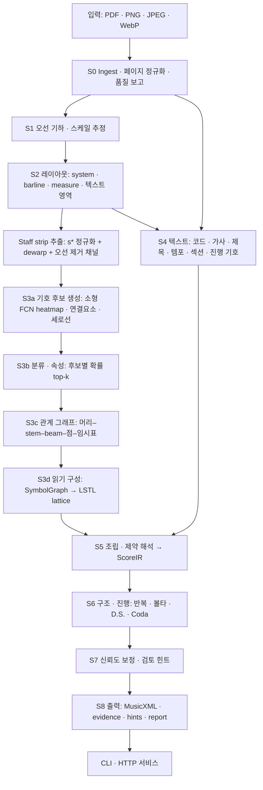
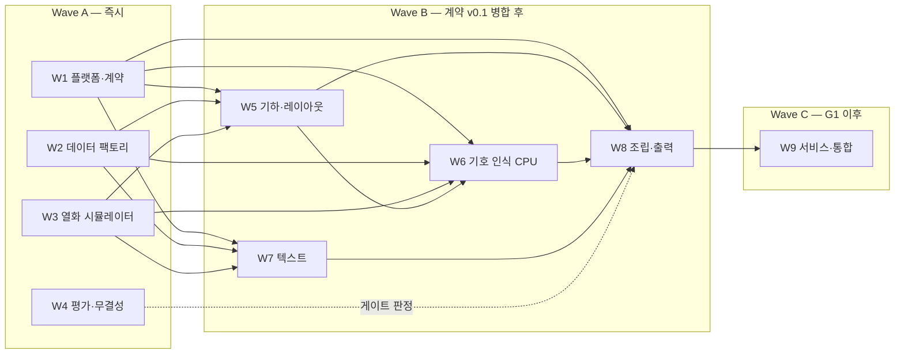

# Clavis 기획서 — HarmonyMaker와 분리된 독립 OMR 엔진

| 항목 | 값 |
|---|---|
| 문서 버전 | **v1.1 (CPU 전용 재설계)**, 사용자 결정 대기 |
| 작성일 | 2026-09-29 |
| 작성 | Orchestrator (Opus 5.5) — 설계·평가·분업 권한만 가지며 직접 구현하지 않음 |
| 구현 | Astra 워커 W1–W9 |
| 규범어 | **해야 한다**(필수) · **권장**(근거 있으면 벗어날 수 있음) · **가능**(선택) |

관련 문서: [CONTRACTS.md](CONTRACTS.md) · [EVALUATION.md](EVALUATION.md) · [GENERALIZATION_CHARTER.md](GENERALIZATION_CHARTER.md) · [tasks/](tasks/)

### 개정 이력

- **v1.1 (2026-09-29)**: GPU를 쓰지 않는 구조로 재설계했다. 보표 단위 대형 시퀀스 모델(R1, 20–40M 파라미터, 110–210 GPU 시간)을 없앴다. 대신 **기호 단위 검출–분류–조립** 구조를 쓴다. 이 구조의 모든 학습은 참조 노트북 CPU에서 모델당 4시간 안에 끝난다(6.3절 AD-2, 7.5절). KPI, 평가 체계, 일반화 헌장, HarmonyMaker 규약은 그대로다. 같은 기준으로 판정한다.
- v1.0 (2026-09-29): 최초 작성

---

## 1. 배경: 왜 새 엔진인가

HarmonyMaker는 지금까지 외부 OMR 엔진을 감싸고, 결과의 결함을 규칙으로 메우는 방식으로 이미지 입력을 다뤘다. 저장소 기록(`docs/implementation/ASTRA_RUNTIME_CLOSURE.md`, `OMR_FOCUS_2026_09_11.md`, `SOURCE_BOUNDARY_V1.md`)에서 확인한 사실은 다음과 같다.

| 시도 | 관측 결과 | 교훈 |
|---|---|---|
| Audiveris 5.10.2 provider (원격, 0.15 CPU / 512 MiB) | 실제 휴대폰 JPEG(1쪽, 8시스템, 못갖춘마디 포함 39마디, interline 약 13 px) 인식 결과가 3개 movement로 쪼개졌다. 30마디, 205 note 요소, overfull 6마디가 나왔고, beam–stem 연결 누락으로 16분→4분 같은 길이 오류가 생겼다. 사람이 465건을 교정했고 최종 284이벤트 중 151개(53%)는 새로 입력해야 했다. | 규칙 기반 엔진의 설정(smallBeams, indentations, 이진화 계수, beam 경계 패치, 프레임 분할)을 바꾼 실험은 **전부 악화되어 기각**됐다. 설정 탐색으로는 일반화되지 않는다. |
| homr(AGPL) + 보완 규칙(코드, 가사, 끝부분 구조, 시간축, 슬래시) | 개발 입력에서 핵심 이벤트가 260→280/285로 좋아졌다. 그러나 문서 스스로 "개발 중 확인한 자료이며 unseen 성능으로 해석하지 않는다"고 적고 있다. 최신 보조 경로도 가사·코드 교정 52명령과 대조 확인 957명령이 필요했다. | 개별 실패를 규칙으로 메우면 개발 입력에 과적합되기 쉽다. AGPL이라 제품 배포에도 제약이 있다. |
| 공통 | 코드 심벌, 한글 가사, 리듬 슬래시, 못갖춘마디, 볼타가 모두 후처리로 덧붙여졌다. | 리드시트 요소는 처음부터 **1급 인식 대상**으로 설계해야 한다. |

**결론.** 필요한 것은 세 가지다. (1) 해상도와 촬영 조건 변화에 견디는 인식, (2) 특정 악보에 맞춘 수정을 구조적으로 막는 평가 체계, (3) HarmonyMaker와 분리된 라이선스 청정 엔진. v1.1은 여기에 (4) **GPU 없이 개발하고 실행한다**는 조건을 더한다.

## 2. 목표와 비목표

### 목표

- **G1 정확도**: 실사용 저해상도 인쇄 악보(리드시트 우선, 찬송가 SATB와 단순 피아노는 다음 순위)에서 HarmonyMaker가 필요로 하는 요소를 MusicXML로 복원한다. 교정이 "가벼운 수정" 수준이 되는 것이 기준이다.
- **G2 정직한 불확실성**: 모든 요소에 보정된 신뢰도와 근거 박스를 붙인다. 편곡을 망칠 수 있는 오류는 **표시되지 않은 채 통과하지 않는다**(HarmonyMaker 스펙 0.5절의 제품 목표와 같다).
- **G3 증명된 일반화**: 성능은 개발 사례가 아니라 sealed 실사 평가로 입증한다.
- **G4 독립성**: 별도 저장소이며 HarmonyMaker 코드에 의존하지 않는다. 연결은 파일과 HTTP 규약으로만 한다. 엔진은 허용 라이선스만 쓴다.
- **G5 CPU 전용**: **학습과 실행 모두 GPU 없이** 참조 노트북(REF-LAPTOP)에서 한다. 실행은 예산(6.4절) 안에 돌고, 같은 입력과 같은 버전이면 같은 결과를 낸다. 외부 컴퓨트 비용은 0원이다.
- **G6 교체 가능성**: HarmonyMaker의 기존 provider HTTP 규약을 구현해, HarmonyMaker는 작은 어댑터만 추가하면 된다.

### 비목표 (v1)

- 손글씨 악보, 타브, 타악기 보표, 오케스트라 총보, 고음악 기보, 비표준 현대 기보
- 조판 레이아웃의 정밀 재현(stem 방향이나 곡선 모양 등 의미와 무관한 부분)
- 런타임의 LLM·VLM·외부 API 사용
- GPU를 전제로 한 모델(대형 시퀀스 모델, 대형 검출기, 파운데이션 모델)
- HarmonyMaker 측 UI와 Review 흐름 구현. 엔진은 힌트와 근거만 제공한다.

## 3. 운영 설계 영역(ODD)

"일반화"는 무엇에 대해 일반화하는지 정해야 측정할 수 있다. 다음이 v1의 운영 설계 영역이다.

| 축 | v1 범위 |
|---|---|
| 입력 형식 | PNG, JPEG, WebP, TIFF, BMP, PDF(디지털·스캔). 여러 페이지. |
| 촬영·유통 경로 | 평판 스캔(150–300 dpi), 휴대폰 사진(원근, 조명, 그림자, 흔들림), 화면 캡처, 메신저 재압축(카카오톡 등), 웹 이미지 |
| 해상도 | **interline**(인접 오선 중심 간 거리)이 7–40 px. 주력 구간은 **8–14 px**. 7 px 미만은 "재촬영" 판정과 이유를 반환한다. |
| 레이아웃 | 단일 보표 리드시트(주력), 2보표(SATB 폐쇄보, 피아노 대보표), 시스템당 최대 4보표(P1). 한 단(column) 레이아웃. |
| 문자 | 한국어, 영어 가사와 텍스트. 코드 심벌은 팝·재즈 표기. |
| OOD 처리 | 범위 밖 입력(오선 없음, 타브, 손글씨 추정, 판독 불가)은 쓰레기 결과 대신 **명시적 OOD 코드**로 반환한다. |

### 기보 요소 지원 수준

- **P0 (v1 필수)**: 높은음자리표, 낮은음자리표, 테너용 8vb 높은음자리표; 조표 ±7; 박자표와 그 변경; 못갖춘마디; 온음표–32분음표; 점 1–2개; 쉼표(온마디 쉼표 포함); 임시표(마디 안 지속 규칙 포함); 붙임줄; 셋잇단; 보표당 1–2성부; 같은 stem의 화음; **리듬 슬래시**; 도돌이표, 볼타, D.S./D.C./Coda/Segno/Fine; 페르마타; **코드 심벌**(슬래시 코드 포함); **가사**(한국어·영어, 여러 절, 하이픈, 연장선); 제목; 템포 표기; 섹션 라벨(Verse, Chorus, 후렴, 간주 등)
- **P1 (v1 목표)**: 이음줄(slur), 꾸밈음, 여러 마디 쉼표, SATB 2보표, 피아노 대보표, 여러 페이지 연결, 가온음자리표
- **P2 (v1 범위 밖)**: 셈여림과 아티큘레이션 대부분, 8va 옥타브선, 트레몰로, 퍼커션, 타브, 손글씨, 총보

## 4. 성공 기준 (KPI)

지표의 정확한 정의와 측정 절차는 [EVALUATION.md](EVALUATION.md) 5절이 정본이다. 여기서는 의미와 목표만 적는다. **v1.1에서도 목표는 바꾸지 않았다.** CPU 전용 구조도 같은 자로 판정한다.

| ID | 지표 | 의미 |
|---|---|---|
| **K1** | 교정 부담 (100 기준 이벤트당 최소 교정 연산 수) | 출력을 정답으로 바꾸는 데 필요한 최소 편집 연산. HarmonyMaker typed patch 어휘 기준. **북극성 지표**다. |
| **K2** | 무표시 오류율 (silent error rate) | 편곡에 영향을 주는 오류 가운데 flag가 붙지 않은 것의 비율(기준 이벤트 수 대비). **안전 지표**다. |
| K3 | harmonizationReadyRate | 무표시 차단 오류가 0인 페이지 비율. HarmonyMaker 스펙 22.3절의 정의를 따른다. |
| K4 | 핵심 정확도 | pitch, duration, measure exact, 조표·박자, 코드 심벌(값+위치), 가사 음절 |
| K5 | 운영 | MusicXML 유효율 100%, 결정성 100%, 지연, 메모리 |
| K6 | 견고성 | interline별 해상도 곡선, 최소 사용 가능 interline, 변환 불변성(metamorphic) 통과율 |

### 잠정 목표(PT)

아래 값은 **잠정**이다. G0의 기준선 측정(B0)과 G2의 Dev 결과를 보고 오케스트레이터가 조정한 뒤 **동결**한다. 동결한 뒤에는 sealed 평가 전까지 바꾸지 않는다(HarmonyMaker 스펙 22.5절과 같은 생애주기).

| 지표 (실사 tier, 리드시트 보표) | interline ≥ 10 px | interline 8–10 px |
|---|---|---|
| K1 교정 연산 / 100 이벤트 | ≤ 6 | ≤ 12 |
| K2 무표시 오류율 | ≤ 0.5% | ≤ 1.0% |
| flag 부담 (flag된 요소 비율) | ≤ 15% | ≤ 25% |
| pitchExactRate | ≥ 97% | ≥ 93% |
| durationExactRate | ≥ 95% | ≥ 90% |
| measureExactMatchRate | ≥ 80% | ≥ 60% |
| 조표·박자 exact | ≥ 98% | ≥ 95% |
| 코드 심벌 exact (값+위치) | ≥ 90% | ≥ 80% |
| 가사 음절 exact (한국어·영어 각각) | ≥ 90% | ≥ 80% |
| MusicXML 유효율 · 결정성 | 100% · 100% | 100% · 100% |

추가 조건 — **기준선 우위**: R-Dev에서 K1이 최고 기준선(Audiveris 5.10.2, homr 고정 revision, oemer 가운데 가장 좋은 것)보다 **상대 30% 이상 낮아야** 한다. 이때 page 단위 paired bootstrap 95% 신뢰구간이 0을 포함하지 않아야 한다.

## 5. 설계 원칙

1. **자를 먼저 만든다 (Ruler first).** 평가 하네스와 기준선 수치(B0)가 나오기 전에는 인식 성능의 개선을 주장하지 않고, 실사 결과를 보며 규칙이나 임계값을 조정하지 않는다. 구성요소 구현은 계약 mock과 합성 데이터로 G0와 병행한다. 이때 쓴 상수는 잠정값이며 G0 이후 헌장 5절 절차로 검증한다.
2. **보는 것은 학습하고, 계산은 이론으로 한다.** 국소 시각 판단(이것이 음표 머리인가, beam이 몇 개인가)은 합성 데이터로 학습한 **작은** 분류기가 맡는다. 음높이(보표 위치 + 음자리표 + 조표 + 임시표), 음길이, 마디 산술은 결정적 코드가 맡는다. 손으로 쓴 규칙은 보편적인 기하·조판 관례와 음악 이론에만 허용하고, 모두 규칙 카탈로그에 등록한다(헌장 4.2절). 특정 이미지의 실패를 덮는 데는 쓰지 않는다.
3. **오선 단위로 정규화한다.** 인식은 모두 staff-space로 정규화한 crop 위에서 한다. 기하 임계값은 모두 staff-space 단위다. 해상도 불변성의 핵심 장치다.
4. **국소 판단은 확률로 남기고, 결정은 전역에서 한다.** 분류기는 하나의 답이 아니라 후보와 확률을 낸다. 마디 길이, 조표, 성부 시간축 같은 전역 제약이 후보 가운데 일관된 조합을 고른다. 초기에 단정하면 오류가 연쇄된다. Audiveris의 beam–stem 실패가 그 예다.
5. **근거가 먼저다 (Evidence-first honesty).** 출력하는 모든 요소에는 시각 근거가 있어야 한다. 제약(마디 길이 등)을 맞추려고 내용을 지어내지 않는다. 불확실하면 대안을 붙여 flag한다. 결과 상태는 complete, partial, blocked로 구분한다.
6. **일반화를 규율로 강제한다.** sealed 보관, 곡·촬영 단위 분리, 변환 불변성 시험, 식별 정보 기반 분기 금지, 규칙 카탈로그와 ablation을 둔다([GENERALIZATION_CHARTER.md](GENERALIZATION_CHARTER.md)).
7. **독립성과 라이선스 위생을 지킨다.** 별도 저장소, 허용 라이선스 의존성만 쓴다. AGPL/GPL 도구는 학습 데이터 렌더링과 기준선 비교에 외부 프로세스로만 쓴다.
8. **결정적이고 재현 가능하게 만든다.** 모델과 코드 해시를 버전으로 묶고 판정 규칙을 고정한다. 같은 입력과 같은 버전이면 바이트 단위로 같은 출력을 낸다. 모든 실험은 설정, 시드, 데이터 manifest로 재현한다.
9. **CPU 예산을 설계 제약으로 삼는다.** 모든 학습은 REF-LAPTOP CPU에서 모델당 벽시계 4시간, RAM 3 GB 안에 끝나야 한다. 넘으면 모델이나 데이터를 줄이거나 ADR로 정당화한다. 실행 예산(6.4절)도 첫날부터 잰다.
10. **안정된 IR로 모듈을 나눈다.** 모듈은 버전이 붙은 IR 스키마로만 소통한다. 그래야 워커가 병렬로 일하고, 모듈을 A/B로 바꿔 끼울 수 있다.

## 6. 시스템 아키텍처

### 6.1 전체 파이프라인



### 6.2 단계별 명세

| 단계 | 역할 | 방법 | 출력 IR | 담당 |
|---|---|---|---|---|
| S0 Ingest | 디코딩(PDF는 pypdfium2로 목표 해상도에 맞춰 래스터화), EXIF 회전, 휘도 변환, 사진의 페이지 경계 검출과 원근 보정, 조명 평탄화, 품질 지표 | 고전 CV | `PageInput`, `QualityReport`, 좌표 프레임 그래프 | W5 |
| S1 오선 기하 | run-length로 interline과 선 두께 추정, 선 추적, 5선 묶기, 곡률 추정 | 고전 CV 우선. 부족하면 소형 U-Net(CPU 학습) | `StaffGeometry` | W5 |
| S2 레이아웃 | system 묶기(괄호·중괄호·system barline), barline과 마디 경계, 읽기 순서, 비오선 영역 마스크 | 고전 + 소형 분류기 | `PageLayout` | W5 |
| Strip 추출 | 보표별로 곡률을 펴고 정규 staff-space s*(기본 16 px)로 리샘플한다. 위아래 여백과 역변환 맵을 보존하고, 오선을 지운 보조 채널을 만든다. | 결정적 기하 | `StripRef` | W5 |
| **S3a 후보 생성** | 소형 FCN heatmap(음표 머리, 쉼표, 임시표, 음자리표, 박자 숫자, 점 등)을 strip 전체에 조밀하게 적용하고, 연결요소와 세로선(stem·barline) 검출을 더해 후보를 만든다. 생성기마다 출처를 기록한다. | 학습(CPU) + 고전 | `SymbolGraph` 후보 | **W6** |
| **S3b 분류·속성** | 후보마다 클래스 확률 top-k(거절 클래스 포함), 보표 위치(pos) 분포, stem 방향, stem 끝의 beam·flag 개수 분포, 점 개수 분포 | 학습(CPU: 작은 CNN, LightGBM) + 기하 | `SymbolGraph` | **W6** |
| **S3c 관계** | 머리–stem, stem–beam/flag, 점–머리, 임시표–머리, 붙임줄·이음줄 끝점, 같은 stem의 화음, 성부 층을 확률과 함께 연결한다. | 조판 관례 규칙(카탈로그) + 소형 분류기 | `SymbolGraph` 관계 | **W6** |
| **S3d 읽기 구성** | 그래프를 보표별 LSTL 항목열로 바꾼다. 각 속성의 대안(top-k)과 관계 모호성에서 N-best를 만든다. x 구간은 기호 박스 그대로다. | 결정적 | `StaffLattice` | **W6** |
| S4 텍스트 | 텍스트 줄 검출, 역할 분류, 코드 인식(문법 제약), 가사 OCR(한·영)과 음절 분리 | **사전학습 OCR(PP-OCRv5, 학습 불필요)** + 소형 코드 인식기(CPU 학습) + 문법 | `TextIR` | W7 |
| S5 조립 | 이론 모듈(보표 위치 → 음높이), 마디와 성부 재구성, 마디 길이 제약 해석(근거 있는 대안 중에서만 선택), 근거 변환, 코드·가사 부착 | 결정적 탐색 | `ScoreIR` | W8 |
| S6 구조 | 도돌이, 볼타, 진행 기호, 여러 페이지 연결, 진행 그래프 검증 | 결정적 | `ScoreIR` 갱신 | W8 |
| S7 보정·힌트 | 요소별 신뢰도 보정(Dev-Tune에서 적합), 검토 힌트와 대안 생성(HarmonyMaker patch 어휘에 대응) | 통계적 보정(CPU) | `ReviewHint[]` | W8 |
| S8 출력 | MusicXML 4.0, evidence.json, review-hints.json, element-confidence.json, report.json | 결정적 직렬화 | 파일 | W8 |
| 서비스 | CLI, HTTP(HarmonyMaker provider 규약 호환 + 확장), job 저장소, 자원 제한 | — | — | W9 |

### 6.3 핵심 설계 결정 (ADR 요약)

- **AD-1 오선 단위 정규화.** 모든 인식 모델은 interline을 s*로 맞춘 strip을 입력으로 받는다. 8 px 사진과 30 px 스캔이 모델에게 같은 크기로 보인다. 학습 때는 저해상도로 떨어뜨린 뒤 같은 정규화를 거친 이미지를 쓰므로, 분류기는 "흐린 16 px 보표 위의 기호"를 판단하는 법을 배운다.
- **AD-2 (v1.1) 기호 단위 검출–분류–조립 + 전역 제약.**
  - **왜 GPU가 필요 없나.** GPU가 필요했던 것은 보표 전체를 한 번에 읽는 20–40M 파라미터 시퀀스 모델이었다. 인식을 "이 작은 영역에 무엇이 있나"라는 국소 판단 여러 개로 쪼개면, 각 판단은 32–48 px 조각을 보는 5만–100만 파라미터 모델로 충분하다. 이런 모델은 합성 조각 수백만 개로도 노트북 CPU에서 1–4시간이면 학습된다. 추론할 때는 같은 모델을 strip 전체에 합성곱으로 조밀하게 적용하므로 검출기처럼 동작한다.
  - **Audiveris와 무엇이 다른가.** 구조가 비슷한 Audiveris는 실패했다. 차이는 다섯 가지다. (1) 초기 전역 이진화 없이 **그레이스케일, 정규화된 크기**에서 판단한다. (2) 분류기를 여러 렌더러·폰트·열화로 만든 **대량 합성 데이터**로 학습한다. (3) beam 개수, 점 유무, 연결 여부 같은 국소 판단을 **확률 후보로 남긴다.** (4) 마디 길이 같은 **전역 제약**이 후보 조합을 고르고, 풀리지 않으면 정직하게 flag한다. 앞의 사례(beam 연결 누락 → 16분이 4분이 됨)는 "beam 2개일 확률 0.3"이 후보로 남아 있으면 마디 길이가 그것을 고른다. (5) 모든 규칙은 카탈로그에 등록되고 ablation과 sealed 평가로 검증된다.
  - **덤으로 얻는 것.** 모든 음표가 검출된 기호에서 오므로 **기호 단위 근거 박스가 자동으로** 생긴다. 오류 원인을 기호 단위로 추적할 수 있고, 반복 실험이 며칠이 아니라 몇 시간이다.
  - **잃는 것 (정직하게).** 대형 시퀀스 모델이 학습하는 긴 문맥(흐린 beam을 리듬 패턴으로 추론하는 능력)이 약해진다. 전역 제약과 선택적 리듬 통계 사전(코퍼스 빈도 계수, 학습 불필요)으로 일부를 메운다. 기호가 빽빽하게 겹치는 피아노·SATB 화음과 극단적으로 흐린 사진에서는 한계가 먼저 드러날 수 있다. 이것은 G2에서 측정한다(7.4절 확장 규칙).
  - 채택하지 않은 것: 전체 페이지 end-to-end 모델(LEGATO류, GPU 필수), 보표 단위 대형 시퀀스 모델(v1.0의 R1, GPU 필요), 규칙만으로 된 엔진(Audiveris 실패 사례).
- **AD-3 음높이는 이론 모듈이 계산한다.** 분류기는 보표 위치(pos), 보이는 임시표, 음자리표·조표 기호만 판단한다. 실제 음높이는 결정적 코드가 계산한다.
- **AD-4 정규 인코딩 + 문법 검증.** 같은 시각 표현은 정확히 하나의 토큰열로 표현한다(LSTL 정규화). 읽기 구성기는 문법 오토마톤을 통과하는 조합만 만든다.
- **AD-5 제약 해석은 선택만 한다.** 마디 길이를 맞추기 위한 탐색은 분류기가 제시한 대안(점 유무, beam 수, 쉼표 종류 등) 가운데 시각적으로 지지되는 것만 고를 수 있다. 근거 없는 음표를 삽입하거나 음표를 잘라서 맞추는 것은 금지다. 맞출 수 없으면 flag하고 상태를 낮춘다.
- **AD-6 텍스트는 사전학습 OCR을 그대로 쓴다.** 코드와 가사는 음악 경로와 분리된 OCR 경로에서 인식한다. 텍스트 검출과 가사 인식은 PP-OCRv5(Apache-2.0) 사전학습 모델을 **학습 없이** 쓴다. 코드 심벌만 작은 전용 인식기를 CPU로 학습할 수 있다(비교로 채택). 코드는 문법으로, 가사는 x좌표 단조 정렬로 음표에 붙인다.
- **AD-7 런타임은 ONNX Runtime CPU만 쓴다.** 학습 도구(PyTorch CPU 휠, LightGBM, scikit-learn)는 `training/`에만 있고 엔진 런타임 의존성이 아니다.
- **AD-8 HarmonyMaker와는 규약으로만 연결한다.** 기존 provider HTTP 규약(`/v1/capabilities`, `/v1/jobs` 등)을 그대로 구현하고 evidence와 힌트 확장 엔드포인트를 더한다. 코드 의존은 없다.
- **AD-9 AGPL/GPL은 격리한다.** Verovio(LGPL), MuseScore·LilyPond(GPL)는 학습 데이터 렌더링 도구로, Audiveris·homr(AGPL)는 기준선 비교용으로만 외부 프로세스로 실행한다. oemer(MIT 코드)의 가중치는 학습 데이터 계보(연구용 데이터셋 포함)가 불분명하므로 기준선으로만 쓴다.

### 6.4 런타임 예산 (REF-LAPTOP: i7-1255U, RAM 24 GB(16 + 8 GB, DDR4-3200 듀얼 채널), GPU 없음, 4 스레드)

| 항목 | v1 예산 | 비고 |
|---|---|---|
| 페이지당 지연(보표 12개 이하) | p50 ≤ 20 s, p95 ≤ 45 s | 단계별 계측을 runtime.json에 기록. 기호 인식은 소형 모델이라 여유가 크다 |
| 최대 상주 메모리(RSS) | ≤ 1.5 GiB | 브라우저와 HarmonyMaker 개발 서버가 함께 도는 환경 |
| 모델 파일 합계 | ≤ 60 MB | 기호 분류기 합계 ≤ 30 MB + PP-OCR 모델. `models/MANIFEST.json`으로 관리 |
| 콜드 스타트 | ≤ 5 s | 모델 로드 포함 |
| 서버 최소 사양 | 1 vCPU / 2 GB | 기존 0.15 CPU / 512 MiB 등급에서는 목표 지연을 낼 수 없음 → 결정 D7 |

실행 예산 보고에는 메모리 구성(24 GB = 16 + 8 GB, DDR4-3200 듀얼 채널)을 기록한다. 증설 전 8 GB 측정값과 섞어 비교하지 않는다. RSS ≤ 1.5 GiB와 작업당 RAM ≤ 3 GB 예산은 유지한다.

### 6.5 저장소 구조와 소유권

```text
clavis-omr/
├─ AGENTS.md · README.md · pyproject.toml · uv.lock        (W1)
├─ docs/                (Orchestrator. 워커는 docs/reports/ · docs/adr/ · docs/ccr/ 에 추가)
├─ src/clavis/          ← 배포되는 엔진 런타임
│  ├─ contracts/        (W1, CCR 필수) IR · LSTL · 오류 코드 · JSON Schema
│  ├─ core/             (W1) 설정 · 좌표 변환 · fixed-point · 해시 · 결정성 유틸
│  ├─ ingest/           (W5) 디코딩 · 페이지 정규화 · 품질 보고
│  ├─ geometry/         (W5) 오선 · dewarp · system · barline · strip · 오선 제거 채널
│  ├─ symbols/          (W6) 후보 생성 · 분류 · 속성 · 관계 · 읽기 구성(lattice)
│  ├─ text/             (W7) 텍스트 검출 · 분류 · 코드 · 가사 · 기타 텍스트
│  ├─ assemble/         (W8) 이론 모듈 · 마디/성부 · 제약 해석 · 부착 · 구조
│  ├─ calibrate/        (W8) 신뢰도 보정 · 검토 힌트
│  ├─ export/           (W8) MusicXML · evidence · hints · report
│  ├─ pipeline/         (골격 W1, 통합 W8) 단계 오케스트레이션
│  ├─ service/          (W9) HTTP 서비스 · job 저장소
│  └─ cli/              (W1)
├─ training/            ← 배포되지 않음 (전부 CPU)
│  ├─ data/             (W2) 코퍼스 · LeadGen · 렌더러 · 라벨 추출 · shard
│  ├─ degrade/          (W3) 열화 시뮬레이터
│  ├─ jobs/             (W1) 재개 가능한 야간 배치 실행기
│  └─ models/           staff (W5) · symbols (W6) · text (W7)
├─ eval/                (W4) 평가기 · GT 도구 · 기준선 실행기 · 무결성 도구 · 보고서
├─ tests/<module>/      (각 모듈 소유자)
├─ configs/<module>/    (각 모듈 소유자. 상수 레지스트리와 규칙 카탈로그 포함)
├─ models/              (git 제외. MANIFEST.json만 추적, W1 관리)
└─ data/                (git 제외. manifests/*.json만 추적, W2·W4 관리)
```

import 방향 규칙(CI로 강제): `src/clavis` → `training`, `eval` 금지. `training` → `src/clavis` 허용. `eval` → `src/clavis`는 **공개 출력 형식 파서와 contracts만** 허용한다(평가는 엔진 내부를 모르는 블랙박스여야 한다).

### 6.6 실행 환경 — 노트북 하나

| 환경 | 용도 | 제약과 규칙 |
|---|---|---|
| **REF-LAPTOP (Windows)** | 개발, 단위 테스트, **학습(야간 배치)**, 렌더링, Dev 평가, 지연·메모리 측정 | GPU 없음, RAM 24 GB(16 + 8 GB, DDR4-3200 듀얼 채널), 여유 디스크 약 10 GB. 무거운 작업은 재개 가능한 배치로 사용자가 노트북을 쓰지 않는 시간에 돌린다. 작업당 RAM ≤ 3 GB, 동시에 쓰는 연산 자원 ≤ 논리 CPU 8개(7.5절), 저장소 데이터 총량 ≤ 4 GB |
| (선택) 무료 클라우드 CPU 노트북 | 대량 렌더링이나 야간 평가의 보조 | 세션 12시간 제한 등 한도가 바뀔 수 있어 **필수 경로에 넣지 않는다.** 사적 데이터(R-TGT, R-LEGACY)는 절대 올리지 않는다 |
| (선택) 외장 저장소 | 렌더 캐시 보관 | 로컬 디스크 여유가 3 GB 아래로 떨어지면 사용 |

## 7. 개발 전략

### 7.1 요지

1. **평가가 먼저다.** 첫 2주 안에 평가기, 기준선 수치(B0), 실사 Dev v0를 확보한다.
2. **투자의 중심은 데이터 엔진이다.** 절차적 리드시트 생성기, 여러 조판 엔진과 폰트, 촬영 경로를 모사하는 열화기, 정답을 공짜로 얻는 인쇄–촬영 실사 데이터가 일반화의 원천이다. 작은 분류기가 강해지는 길은 모델을 키우는 것이 아니라 **데이터의 다양성**이다.
3. **학습 없는 기준을 먼저 세운다.** 기호 인식은 폰트 템플릿 매칭만으로 된 "무학습 구성"을 먼저 만들고, 학습한 분류기가 그보다 얼마나 나은지 수치로 보인다. 학습이 이득을 증명하지 못하는 부분은 단순한 쪽을 남긴다.
4. **수직 슬라이스를 일찍 만든다.** 모든 단계가 최소 기능이라도 끝까지 연결된 상태를 G1에서 확보하고, 그 뒤 병목 단계를 교체하며 개선한다.
5. **규칙이 아니라 분포로 고친다.** 실패 사례를 발견하면 그 사례를 고치지 않는다. 실패 **패턴**을 합성 데이터 계열로 일반화해 학습·검증한다(헌장 5절).
6. **게이트로 진행한다.** 날짜가 아니라 증거로 다음 단계에 들어간다.

### 7.2 데이터 전략

| 구성 | 내용 | 담당 |
|---|---|---|
| 기호 코퍼스 | PDMX의 라이선스 충돌 없는 공개 도메인·CC0 하위집합(MuseScore 커뮤니티 25만+ 곡), 기타 PD 코퍼스. 라이선스 등록부로 관리한다. | W2 |
| **LeadGen** 절차적 생성기 | 찬양·팝 리드시트의 분포를 넓게 덮는다. 조, 박자(변경 포함), 못갖춘마디, 당김음, 붙임줄, 셋잇단, 2성부 구간, 리듬 슬래시, 코드 진행(슬래시·sus·add·7th), 여러 절 가사, 반복·볼타·D.S./Coda, 섹션 라벨을 무작위 생성한다. 한국어 가사는 저작권이 만료된 시·문장으로 만든다. | W2 |
| 렌더링 다양화 | Verovio(Leipzig, Bravura, Gootville, Leland, Petaluma), MuseScore 4(Leland, Bravura, Petaluma, 재즈 텍스트 폰트), 선택적으로 LilyPond. 용지, 여백, 보표 크기, 간격, 코드·가사 폰트(한글 OFL 폰트 포함), 머리글, 페이지 번호, 잡음 요소를 무작위화한다. **렌더는 SVG와 라벨로 저장하고 래스터는 필요할 때 만든다**(디스크 절약). | W2 |
| 열화 | 기하(회전, 원근, 종이 휨), 광학(초점 흐림, 흔들림), 조명(그라데이션, 그림자), 센서 잡음, **목표 interline로 다운샘플**, JPEG·WebP 반복 압축, 이진화·디더링, 비침, 얼룩, 모아레, 잘림. 촬영 경로별 프리셋을 둔다. | W3 |
| **학습 조각(patch) 샘플러** | 렌더 페이지 → 열화 → strip 추출 → 라벨 기준 양성 조각, 배경·혼동 음성 조각, 어려운 음성 조각 채굴. 즉석 생성하고 캐시는 2 GB 이하로 둔다. | W6 |
| **인쇄–촬영 실사(R-PC)** | 평가 전용 곡을 렌더링해 인쇄하고 여러 휴대폰, 조명, 각도, 스캐너, 메신저 경로로 수집한다. 정답은 원본 MusicXML이므로 정확하고 비용이 없다. | W4 + Custodian |
| 실제 판각 스캔(R-LIED) | OpenScore Lieder(CC0 MusicXML)와 그 원본인 IMSLP 공개 도메인 스캔. **평가 전용이며 학습에 쓰지 않는다.** | W4 |
| 대상 도메인(R-TGT) | 사용자가 가진 한국 찬양 리드시트. 권리 확인(평가 전용), 비공개 보관, 수기 정답. | Custodian |

일반화 원칙: **학습 분포는 대상 분포보다 넓어야 한다.** 실사 이미지가 "학습에서 본 변형 중 하나"처럼 보이게 만드는 것이 목표다. 실사 Dev의 **통계**(interline 분포, 흐림, 압축 강도)는 열화 분포 조정에 쓸 수 있다. 그러나 **개별 이미지의 픽셀이나 내용**을 학습 데이터에 옮기는 것은 금지다.

### 7.3 모델 전략 (전부 CPU)

| 모델 | 규모 | 학습 도구 | 학습 시간 상한(REF-LAPTOP) | 담당 |
|---|---|---|---|---|
| 기호 heatmap FCN (머리·쉼표·임시표·음자리표·숫자·점 등, 1–3개) | 각 5만–100만 파라미터 | PyTorch CPU | 모델당 4시간 | W6 |
| 후보 분류기·속성 추정기(beam·flag 개수, stem 방향, 점) | 각 1만–50만 파라미터, 또는 LightGBM | PyTorch CPU / LightGBM | 모델당 2시간 | W6 |
| 관계 분류기(머리–stem 등 모호한 연결) | LightGBM | LightGBM | 30분 | W6 |
| 오선 분할 U-Net (고전 방법이 부족할 때만) | ≤ 50만 | PyTorch CPU | 4시간 | W5 |
| 코드 심벌 인식기 (사전학습 OCR보다 나을 때만 채택) | ≤ 100만 | PyTorch CPU | 4시간 | W7 |
| 텍스트 역할 분류기 | LightGBM | LightGBM | 30분 | W7 |
| 신뢰도 보정기 | isotonic / Platt | scikit-learn | 수 분 | W8 |
| 텍스트 검출·가사 인식 | PP-OCRv5 사전학습 | **학습 없음** | 0 | W7 |

- **작은 모델의 힘은 데이터에서 나온다.** 모델을 키우기 전에 조각 샘플러의 다양성, 어려운 음성 채굴, 열화 분포를 먼저 개선한다.
- **학습–추론 일치**: 학습 조각은 추론과 **같은 strip 추출 함수**와 같은 정규화로 만든다. 정답 기하에 W5 검출 오차 분포만큼 흔들기를 더하고, 일부는 W5 검출 결과로 직접 만든다.
- **모든 학습은 재개 가능한 배치**다(W1 `training/jobs/`). 중단돼도 체크포인트에서 이어진다. 시드와 데이터 manifest로 재현한다.
- **필수 ablation (G1–G2)**: 무학습 템플릿 vs 학습 분류기; s* ∈ {12, 16}; 오선 제거 채널 유무; 후보 생성기 조합; 속성 top-k 폭; 리듬 통계 사전 유무; test-time augmentation(스케일 ±8% 재실행 합의) 유무.

### 7.4 단계와 게이트

| 단계 | 목적 | 핵심 산출물 | 종료 게이트 (상세: EVALUATION.md 9절) |
|---|---|---|---|
| **Phase 0 — 자와 기반** (1–2주) | 평가 체계와 계약 확정 | 저장소·CI, 계약 v0.1, 평가기 v1, Dev v0(≥ 20쪽), **기준선 B0** | **G0**: 평가기 검증(돌연변이 시험), B0 보고서, 무결성 스캐너가 CI에 연결 |
| **Phase 1 — 데이터 엔진과 수직 슬라이스** (3–4주) | 끝까지 연결 | 데이터 팩토리, 열화기 v1, 오선·strip, 기호 인식 v0(무학습 + 첫 분류기), 텍스트 v0(사전학습 OCR), 조립·출력 v0, CLI | **G1**: 이미지 → MusicXML + evidence가 끝까지 동작, 결정성 통과, 합성·실사 지표 보고 |
| **Phase 2 — 저해상도 견고성** (4–6주) | 일반화 확보 | 열화 학습, 관계·속성 분류기, 제약 해석, 보정, 품질 게이트 재보정, 해상도 곡선 | **G2**: R-Dev에서 기준선 대비 K1 30% 우위, PT(8–10 px 구간 포함) 근접, 예산 충족, 임계값 동결 초안 |
| **Phase 3 — 리드시트 완성 + Sealed #1** (4–6주) | 제품 수준 기능 | 가사(한·영, 여러 절), 구조·진행, 2성부, 여러 페이지, 힌트, HTTP 서비스 | **G3**: 임계값 동결 → Custodian이 sealed #1 실행 → 동결 기준 충족 시 **v1.0 RC** |
| **Phase 4 — 통합과 확장** | HarmonyMaker 연결 | 규약 적합성 시험, HarmonyMaker 측 어댑터(HarmonyMaker 저장소 별도 작업), 데이터 선순환 | **G4**: HarmonyMaker E2E 통과, 배포 사양 확정 |

기간은 참고치다. Custodian의 실사 데이터 작업 속도와 노트북 야간 실행 가능 시간에 따라 달라진다.

**G2 확장 규칙 (목표 미달 시).** G2에서 PT에 미달하면 오케스트레이터가 원인을 슬라이스별로 분해해 보고한다. 동결 전이라도 **목표를 조용히 낮추지 않는다.** 선택지는 다음 순서로 제시하고, 비용이 드는 선택은 사용자 결정 없이 하지 않는다.

1. 데이터·샘플러·열화 분포 보강(비용 0, 기본)
2. 약한 슬라이스의 ODD 조정. 예: 재촬영 기준 interline 상향(비용 0, 제품 범위 축소)
3. 작은 보조 시퀀스 모델을 여러 밤에 걸쳐 CPU로 학습하는 연구 트랙(비용 0, 느림)
4. 무료 GPU 할당량(Kaggle 등)을 쓰는 실험(비용 0, v1.1 원칙 예외 → **사용자 승인 필요**)
5. 유료 GPU(비용 발생 → 사용자 승인 필요)

### 7.5 컴퓨트 계획 — GPU 0시간, 비용 0원

- **T1.9 연산 자원 상한(Orchestrator 승인, 2026-09-29)**: 동시에 쓰는 연산 자원 ≤ 논리 CPU 8개. OS 스레드 수는 상한이 아닌 진단값이다.
- 큐가 OMP/MKL/OPENBLAS/NUMEXPR 환경 변수, torch intra/inter op, LightGBM num_threads, onnxruntime intra/inter op, cv2 스레드 설정을 직접 주입하고 CPU affinity로 자식·손자까지 제한한다. Windows Job Object가 상속·일괄 종료를 보장한다.
- 논리 CPU가 8개 이하인 기계에서는 전체 − 1개를 사용한다. Below Normal 우선순위로 실행하고 CPU 사용률 평균·최대(논리 CPU 환산)를 기록한다. 평균이 8 CPU를 넘으면 경고한다.

| 작업 | 장소 | 추정 벽시계 시간 |
|---|---|---|
| 렌더링(Verovio 2만 쪽 + MuseScore 5천 쪽, 여러 번에 나눠) | 노트북 야간 | 합계 6–12시간 |
| 기호 FCN·분류기 학습(모델 4–6개, 재학습 포함) | 노트북 야간 | 합계 20–40시간 |
| 오선 U-Net, 코드 인식기(필요할 때만) | 노트북 야간 | 각 2–4시간 |
| 역할 분류기, 관계 분류기, 보정기 | 노트북 | 각 수 분–30분 |
| 가사 OCR | 사전학습 모델 | 0 |
| 평가: PR용 빠른 세트 / nightly 전체 세트 | 노트북 | 15–20분 / 1–2시간 |

- Phase 1–3 동안 **주당 5–15시간 정도의 야간 CPU 사용**이 예상된다. 노트북 절전 설정과 전원 연결이 필요하다(D1).
- 디스크: 저장소 데이터 총량을 4 GB 이하로 유지한다. 렌더는 SVG + 라벨(압축)로 저장하고 래스터와 조각은 즉석 생성한다. 여유가 3 GB 아래로 떨어지면 외장 저장소를 쓴다.
- 이 추정은 설계 단계 값이다. W6의 첫 PR에서 실제 CPU 학습 속도를 재서 갱신한다.

### 7.6 기존 HarmonyMaker 자산의 처리

| 자산 | 처리 |
|---|---|
| `experiments/homr-integration/*`(chord·lyric·ending·timeline 복구 규칙) | **이식하지 않는다.** 개발 입력에 맞춰진 규칙이고 homr(AGPL) 출력에 의존한다. 실패 유형 목록만 교훈으로 참고한다. |
| `services/audiveris-provider` | 이식하지 않는다(AGPL). HTTP 규약은 CONTRACTS.md 10절에 독립적으로 재기술했다. |
| HarmonyMaker 평가 코드(`src/domain/omr/evaluation.ts`) | 지표 이름과 corpus manifest 필드를 **호환 목표**로 삼는다. 코드는 가져오지 않는다. |
| 기존 개발 이미지(사용자 JPEG, 독립 A/B/C, 자체 제작 6/8 악보 등) | **R-LEGACY**로 분류한다. 이미 개발에 쓰여 오염됐으므로 Dev 회귀 사례로만 쓰고 sealed에는 절대 넣지 않는다. |

## 8. 평가 방법 요약

정본은 [EVALUATION.md](EVALUATION.md)다.

- **데이터 tier**: SYN(합성), R-PC(인쇄–촬영, 정확한 GT), R-LIED(실제 판각 스캔, 평가 전용), R-TGT(한국 찬양 리드시트, 비공개), R-LEGACY(오염된 기존 개발 입력, Dev 전용).
- **분할**: 곡 단위와 촬영 세션 단위로 분리한다. 평가 전용 곡 풀(eval-reserved pool)의 멜로디 지문을 학습 데이터에서 자동으로 걸러낸다.
- **Sealed 보관**: Custodian(권장: 사용자 본인)이 워커 환경 밖에 보관한다. 워커는 해시 목록만 받는다. 실행은 Custodian이 동결된 빌드로 하고 **집계만 공개**한다. 실행 횟수를 제한하고 원장에 기록한다.
- **지표**: K1–K6 + HarmonyMaker 스펙 22.1–22.3절 지표 이름을 그대로 쓴다. page 단위 bootstrap 신뢰구간을 보고하고, A/B는 paired bootstrap으로 비교한다. 해상도 구간, 촬영 경로, 조판 도구, 기보 특성별로 층화해 보고한다.
- **기준선**: Audiveris 5.10.2, homr(HarmonyMaker 고정 revision `457e7c65…`), oemer. 모두 CPU로 돈다. 기준선을 이미지별로 튜닝하지 않는다. 내부 기준으로 Clavis 무학습 구성도 함께 잰다.

## 9. 일반화 보증 체계

정본은 [GENERALIZATION_CHARTER.md](GENERALIZATION_CHARTER.md)다. 다섯 겹으로 방어한다. v1.1 구조는 조립 규칙이 많아지므로 **규칙 카탈로그**가 특히 중요하다.

1. **규칙**: 식별 정보 기반 분기, 개별 이미지 기반 상수 조정, 정답 조회표, sealed 접근을 금지한다.
2. **구조**: sealed 보관 분리, 평가 전용 곡 풀, R-LIED 학습 금지, Dev-Tune/Dev-Check 분리, 임계값 동결.
3. **자동 탐지**: 하드코딩 스캐너(AST), 누출 검사(지각 해시·멜로디 지문), 변환 불변성 시험, 매 CI 새 시드로 만든 합성 곡 시험, 규칙별 on/off ablation.
4. **리뷰**: PR 체크리스트, 규칙 카탈로그 등록, "실패 패턴 일반화" 증명 요구, 오케스트레이터 게이트 리뷰.
5. **최종 판정**: sealed 실사 평가. 실패하면 임계값을 바꾸지 않고 다음 마일스톤에서 새 sealed로 재평가한다.

## 10. Astra 워커 분업 구조

### 10.1 역할

| ID | 이름 | 미션 | 소유 경로 | 투입 |
|---|---|---|---|---|
| Orchestrator | Opus 5.5 | 설계, 계약 승인(CCR/ADR), 게이트 판정, 우선순위 조정. **구현하지 않는다.** | `docs/` | 상시 |
| Custodian | 사용자(권장) | sealed 데이터 보관·실행, 실사 촬영 세션, 대상 도메인 정답 작성, 결정 D1–D7 | 저장소 밖 | 상시 |
| **W1** | 플랫폼·계약 | 저장소, CI, 계약 패키지, LSTL 코어, 좌표·fixed-point, CLI·파이프라인 골격, 모델 레지스트리, 결정성 하네스, **재개 가능한 CPU 배치 실행기** | `src/clavis/{contracts,core,cli,pipeline}`, `training/jobs/`, 루트 설정 | Wave A |
| **W2** | 데이터 팩토리 | 라이선스 등록부, 코퍼스 정규화, LeadGen, 렌더링, 라벨 추출(LSTL, 기호 박스와 관계, 오선 기하, 텍스트), shard | `training/data/` | Wave A |
| **W3** | 열화 시뮬레이터 | 촬영 경로 모사 열화 라이브러리, 라벨 변환, 사실성 평가 | `training/degrade/` | Wave A |
| **W4** | 평가·무결성 | GT 형식, 평가기, 정렬, 지표, 기준선 실행기, Dev 데이터셋, sealed 도구, 스캐너, 변환 불변성 시험 | `eval/` | Wave A |
| **W5** | 기하·레이아웃 | S0–S2, strip 추출과 오선 제거 채널, 품질 보고 | `src/clavis/{ingest,geometry}`, `training/models/staff` | Wave B |
| **W6** | **기호 인식(CPU)** | S3a–S3d: 후보 생성, 소형 분류기 학습(CPU), 속성·관계, 읽기 구성(LSTL lattice), 무학습 템플릿 기준 | `src/clavis/symbols`, `training/models/symbols` | Wave B |
| **W7** | 텍스트 | S4: 사전학습 OCR 연결, 역할 분류, 코드 인식(문법 제약), 가사 음절 분리, 기타 텍스트 | `src/clavis/text`, `training/models/text` | Wave B |
| **W8** | 조립·보정·출력 | S5–S8, 파이프라인 통합, MusicXML 품질 | `src/clavis/{assemble,calibrate,export}` | Wave B |
| **W9** | 서비스·통합 | HTTP 서비스, 로컬 실행기, 패키징, 성능 최적화, 규약 적합성 시험, HarmonyMaker 어댑터 설계서 | `src/clavis/service`, `deploy/` | Wave C |

**직무 분리**: W4(평가)는 모델을 튜닝하지 않는다. 모델 워커(W5–W8)는 평가기를 수정하지 않는다. sealed 데이터는 Custodian만 다룬다. 오케스트레이터도 sealed 내용을 보지 않는다.

**노트북 공유 규칙**: 학습과 렌더링이 모두 같은 노트북에서 돌기 때문에, 무거운 배치는 W1 실행기의 **단일 큐**로만 돌린다(동시 1개). 각 워커는 배치를 큐에 등록하고 결과를 받는다.

### 10.2 의존 관계와 Wave



- Wave A의 네 워커는 서로 거의 독립적이다. W2와 W3는 CONTRACTS.md 초안을 보고 먼저 시작하고, W1의 계약 패키지가 병합되면 맞춘다.
- Wave B 워커는 상류 산출물이 준비되기 전에 **계약의 예시 fixture와 mock**으로 시작한다. W8은 LSTL fixture로 이론 모듈과 MusicXML 작성기를 먼저 만든다. W6은 W2 렌더가 나오기 전에 폰트 템플릿 기반 무학습 구성으로 시작한다.
- 동시 활성 워커는 **최대 8명**이다. 통합 부담이 커지면 오케스트레이터가 줄인다.

### 10.3 운영 방식

- **브랜치와 PR**: `w{n}/<topic>` 브랜치에서 작은 PR을 만든다. main 병합은 CI 통과와 CODEOWNERS 리뷰가 필요하다. 계약이나 공용 모듈을 건드리면 해당 소유자 리뷰가 필수다.
- **CCR**(Contract Change Request): `docs/ccr/CCR-NNNN.md`로 제안한다. 오케스트레이터가 승인하면 W1이 계약 버전을 올리고 마이그레이션한다.
- **ADR**(Architecture Decision Record): `docs/adr/ADR-NNNN.md`. 선택지, 실험 근거, 결정을 적는다. 번호표는 00_COMMON.md 3절에 있다.
- **보고**: 작업 단위마다 00_COMMON.md 7절 양식으로 쓰고, 지표는 평가기 JSON을 첨부한다. 보고서는 `docs/reports/Wn/`에 저장한다. CPU 배치 시간도 적는다.
- **게이트 리뷰**: 게이트마다 W4가 게이트 보고서 초안을 만들고, 사용자가 오케스트레이터에게 전달한다. 오케스트레이터는 PASS/FAIL/조건부 PASS를 판정하고 `docs/gates/Gn_REVIEW.md`에 기록한다.

### 10.4 핵심 산출물 책임표

| 산출물 | 작성 | 승인 | 참고 의견 |
|---|---|---|---|
| 계약(IR, LSTL, 출력 형식) | W1 | Orchestrator | W6, W8, W4 |
| 평가기·지표 정의 | W4 | Orchestrator | 전원 |
| 데이터 manifest·라이선스 등록부 | W2, W4 | Orchestrator | — |
| 모델 가중치·모델 카드 | W5, W6, W7 | W4(평가), Orchestrator(게이트) | W9(예산) |
| 규칙 카탈로그 | W6, W8(각자 규칙) | W4(ablation 검증), Orchestrator | — |
| 임계값 동결 artifact | W8 초안, W4 검증 | Orchestrator | Custodian |
| Sealed 실행 보고 | Custodian | Orchestrator | — |
| 릴리스(엔진 빌드) | W9 | Orchestrator | W4 |

## 11. 마일스톤 로드맵 (참고)

| 주차(참고) | 사건 |
|---|---|
| 0 | D1, D3–D7 결정, 찬양 악보 보류 폴더 분리(D2 보류 규칙), Wave A 투입 |
| 1 | 저장소·CI·계약 v0.1 병합 → Wave B 투입. Custodian 촬영 세션 #1 (R-PC Dev v0) |
| 2 | **G0**: 평가기 검증, B0 기준선, Dev v0 |
| 3–5 | 렌더 대량 생산(야간), 무학습 기호 인식 → 첫 CPU 분류기, 텍스트 v0, 조립·출력 v0 |
| 6 | **G1**: 수직 슬라이스 |
| 7–11 | 열화 커리큘럼, 속성·관계 분류기, 제약 해석, 보정, 품질 게이트 |
| 12 | **G2**: 저해상도 견고성, 임계값 동결 초안. **D2 Sealed Custodian 지정 마감** |
| 13–17 | 가사·구조·2성부·여러 페이지, 서비스. Custodian sealed 구축 |
| 18 | 임계값 동결 → **G3**: sealed #1 → v1.0 RC |
| 19+ | **G4**: HarmonyMaker 통합, 데이터 선순환 |

## 12. 리스크와 대응

| ID | 리스크 | 가능성 | 영향 | 대응 | 책임 |
|---|---|---|---|---|---|
| RK1 | 합성–실사 격차로 실사 성능이 낮음 | 높음 | 높음 | 인쇄–촬영 실사 Dev, 열화 사실성 평가(도메인 분류기), 촬영 경로 프리셋, 선택적 R-PC-Train, 분포 수준 스타일 보강 | W2, W3, W4 |
| RK2 | 실사 정답 부족 | 높음 | 높음 | 인쇄–촬영(정답 무료), OpenScore Lieder, 부분 정답(평가 영역 지정)으로 수기 부담 절감 | W4, Custodian |
| RK3 | **작은 분류기의 표현력 한계**(겹친 기호, 극저해상도) | 중간 | 높음 | 전역 제약, 속성 top-k, 어려운 음성 채굴, test-time augmentation, 7.4절 확장 규칙 | W6, W8 |
| RK4 | **조립 규칙 증가 → 하드코딩 유입** | 높음 | 높음 | 규칙 카탈로그, 규칙별 ablation, 실패 패턴 일반화 요구, 게이트마다 규칙 수와 기여도 보고 | W6, W8, W4 |
| RK5 | 한글 가사 OCR 품질 | 중간 | 중간 | PP-OCRv5 한국어 사전학습 모델, 악보용 음절 덩어리 분할. 가사는 음높이 판정과 분리 | W7 |
| RK6 | 손글씨풍 코드 폰트, 다양한 코드 표기 | 중간 | 중간 | 폰트 다양화, 문법 제약 디코딩, 소형 코드 인식기(CPU), HarmonyMaker 코드 어휘 적합성 fixture | W7 |
| RK7 | 라이선스 오염(AGPL 코드·NC 데이터 혼입) | 중간 | 높음 | 라이선스 등록부, CI 의존성 스캔, 클린룸 규칙, 가중치별 데이터 계보 | W1, W2 |
| RK8 | 반복 튜닝으로 Dev 과적합 | 높음 | 높음 | 헌장, Dev-Tune/Check 분리, sealed 보관, 새 시드 시험, 실패 패턴 일반화 요구 | W4, 전원 |
| RK9 | **노트북 자원 경합**(디스크 10 GB, RAM 24 GB(16 + 8 GB, DDR4-3200 듀얼 채널), 사용자 작업과 충돌) | 높음 | 중간 | 단일 배치 큐, 야간 실행, 재개 가능 작업, 데이터 총량 4 GB 상한, SVG 저장·즉석 래스터화, 외장 저장소 | W1, W2 |
| RK10 | HarmonyMaker 규약 불일치 | 중간 | 중간 | 규약 적합성 시험 스위트, 계약 버전 관리, G4 E2E | W9 |
| RK11 | 워커 간 통합 충돌 | 중간 | 중간 | 경로 소유권, CCR, mock 우선, 작은 PR, Wave 투입 | W1, Orchestrator |
| RK12 | Custodian 작업량 과다 | 중간 | 높음 | 인쇄–촬영 위주 설계, 부분 정답, 작업 시간 추정 공개(EVALUATION.md 10절) | Orchestrator |

## 13. 사용자 결정 필요 사항

| ID | 결정 | 권장안 | 영향 |
|---|---|---|---|
| **D1** | CPU 작업 장소와 저장 공간 (GPU는 쓰지 않음) | 노트북 야간 배치. 절전 해제와 전원 연결, C: 여유 공간 확보(데이터 상한 4 GB), 가능하면 외장 저장소. 무료 클라우드 CPU는 보조로만 | 학습·렌더링 속도 |
| D2 | Sealed Custodian (**G2 전까지**, 약 12주차) | 지금은 **보류 폴더 규칙만** 지킨다: 가진 찬양 악보를 "Dev 후보"와 "보류"(10–15쪽 이상)로 나누고, 보류 쪽은 워커와 오케스트레이터 누구에게도 보여주지 않는다. 보관자 지정은 G2 전에 한다. 따로 정하지 않으면 사용자 본인이 기본값이다. 데이터는 워커 환경 밖(개인 드라이브, 암호화 압축 파일)에 보관 | 일반화 증명의 신뢰성. 보류 규칙이 깨지면 해당 악보는 영구히 Dev 전용이 된다 |
| D3 | 라이선스 방침 | 엔진 코드와 가중치를 MIT 또는 Apache-2.0로 공개 가능한 상태로 유지(실제 공개 여부는 무관). AGPL 배제 확정 | 의존성 선택 |
| D4 | 대상 도메인 악보 권리 | 사용자가 가진 찬양 리드시트를 **평가 전용**으로 사용. 학습 사용은 곡별 별도 opt-in | R-TGT 규모 |
| D5 | 저장소 위치·호스팅 | 현재 `work/clavis-omr`. 비공개 GitHub 저장소 생성 여부를 W1 투입 전에 정함 | CI |
| D6 | 범위 우선순위 | 리드시트(단일 보표 + 코드 + 가사) 우선, SATB·피아노는 P1 | Phase 3 범위 |
| D7 | 배포 형태 | 로컬(Windows, HarmonyMaker `/local-image` 경로) 우선, 서버(≥ 1 vCPU / 2 GB)는 G4에서 결정 | W9 범위 |

### 결정 기록

| ID | 결정 | 날짜 |
|---|---|---|
| D1 | 배치 실행 허용 시간대: **매일 01:00–07:00**(그 외는 사용자 수동 시작만). 노트북은 이 시간에 켜 두고 절전을 끈다 | 2026-09-29 |
| D3 | 권장안 채택: MIT 또는 Apache-2.0로 공개 가능하게 유지, AGPL 배제 | 2026-09-29 |
| D4 | 권장안 채택: 찬양 악보는 평가 전용. Dev 후보 11쪽을 사용자가 저장소 밖 `omr_DEV후보` 폴더로 분리함 | 2026-09-29 |
| D5 | **GitHub 비공개 저장소 `jooa1018/clavis-omr`** 생성(W1 수행) | 2026-09-29 |
| D6 | 권장안 채택: 리드시트 우선 | 2026-09-29 |
| D7 | 권장안 채택: 로컬 실행 우선, 서버는 G4에서 결정 | 2026-09-29 |
| D2 | 미정. G2 전까지 지정. 보류 폴더 규칙은 적용 중 | — |

**Custodian 예상 작업량** (상세: EVALUATION.md 10절): 촬영 세션 2회에 각 1.5시간, 대상 도메인 Dev 정답 작성에 부분 정답 기준 쪽당 15–30분 × 15–20쪽, sealed 구축 3–8시간, sealed 실행 1회당 30분.

## 14. Phase 4 이후 백로그

- **보조 인식기와 융합**: 필요성이 측정으로 증명되면 7.4절 확장 규칙의 선택지(CPU 학습 소형 시퀀스 모델 등)를 2차 인식기로 붙이고, 불일치를 검토 대안으로 쓴다(HarmonyMaker Step 11의 secondary recognizer, candidate fusion에 해당).
- **교정 데이터 선순환**: HarmonyMaker 사용자의 opt-in 교정만 사용한다. 필요한 crop만 보관하고 제목, 작곡가, 전체 가사는 제거한다(스펙 22.8절). 작은 분류기는 CPU로 재학습할 수 있어 선순환 비용이 낮다.
- **외부 비교 가능성**: Sheet Music Benchmark(OMR-NED), OLiMPiC(TEDn) 하위집합 결과를 보고한다(라이선스 확인 후).
- **촬영 가이드 UX 신호**: 품질 예측기가 "예상 교정 부담"을 반환해 HarmonyMaker가 재촬영을 안내하게 한다.

## 부록 A. 용어

| 용어 | 뜻 |
|---|---|
| interline / staff space | 인접한 두 오선 중심 사이의 거리(px). 모든 기하 단위의 기준 |
| s* | 정규 staff-space. strip 리샘플 목표값(기본 16 px) |
| strip | 보표 하나를 곡률 보정하고 s*로 정규화한 가로로 긴 이미지 |
| 후보(candidate) | 기호가 있을 수 있는 위치. 여러 생성기가 만들고 분류기가 판정한다 |
| SymbolGraph | 판정된 기호와 그 사이 관계(머리–stem–beam 등)를 확률과 함께 담은 그래프 |
| FCN heatmap | 작은 합성곱망을 strip 전체에 적용해 각 위치의 기호 확률을 낸 지도 |
| LSTL | Lead-Sheet Staff Token Language. 보표 하나의 시각 내용을 표현하는 토큰 언어(CONTRACTS.md 4절) |
| lattice | 속성 대안과 N-best 가설을 담은 보표 읽기 결과 |
| evidence | 출력 요소가 이미지의 어디에서 왔는지 나타내는 근거 박스와 신뢰도 |
| flag | 검토가 필요하다는 표시. 검토 힌트(review hint)로 출력 |
| 규칙 카탈로그 | 손으로 쓴 모든 조립 규칙의 등록부. 규칙마다 근거, 단위, ablation 기여도를 기록한다 |
| Custodian | sealed 데이터를 보관하고 실행하는 사람(개발에 관여하지 않음) |
| Dev-Tune / Dev-Check | 조정용 Dev와 확인용 Dev. 임계값과 보정은 Dev-Tune에서만 적합한다 |

## 부록 B. 참고 자료

- LEGATO (ICLR 2026, GPU 필수라 채택하지 않음): <https://arxiv.org/abs/2506.19065>
- Transcoda (2026-05, 소형 모델·정규 인코딩·문법 디코딩): <https://arxiv.org/abs/2605.10835>
- Sheet Music Benchmark / OMR-NED (ISMIR 2025): <https://arxiv.org/abs/2506.10488>
- OLiMPiC / LMX / TEDn (ICDAR 2024): <https://github.com/ufal/olimpic-icdar24>
- PDMX: <https://github.com/pnlong/PDMX> (Zenodo, no_license_conflict 하위집합 권장)
- oemer (MIT 코드, 기준선 전용): <https://github.com/BreezeWhite/oemer>
- homr (AGPL-3.0, 기준선 전용): <https://github.com/liebharc/homr>
- PP-OCRv5 한국어 인식: <https://huggingface.co/PaddlePaddle/korean_PP-OCRv5_mobile_rec>
- MusicXML 4.0 레퍼런스: <https://www.w3.org/2021/06/musicxml40/>
- HarmonyMaker 스펙 v3.1.5, 20–22절(OMR Vendor Adapter, Evidence, 평가 Gate) — 호환 발췌는 CONTRACTS.md 12절
